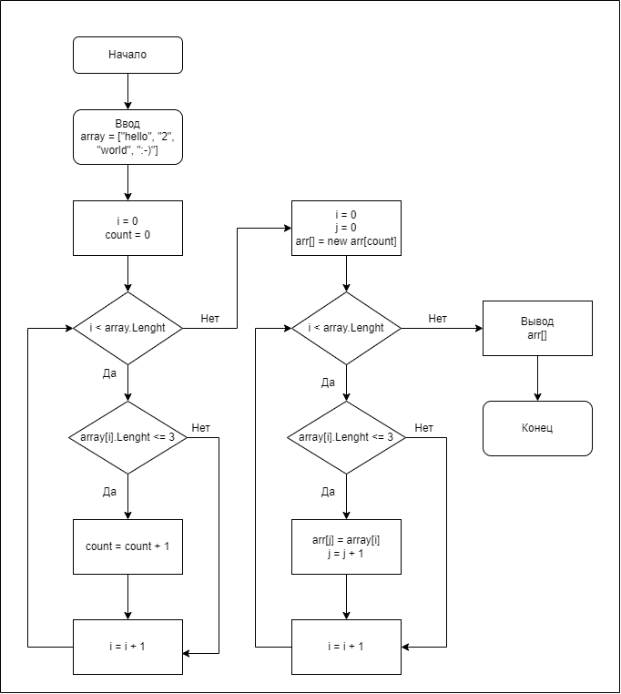

Текстовое описание решения
1.	Создаем переменную count = 0, в которую будем считать количество строк первоначального массива, длина которых меньше либо равна 3.
2.	Считаем длину строки каждого элемента первоначального  массива и если она меньше либо равна 3, увеличиваем переменную count на 1.
3.	Создаем новый массив строк,  длина которого равна переменной count.
4.	Сравниваем длину строки первоначального массива и если она меньше либо равна 3, записываем эту строку в новый массив.
5.	Выводим новый массив.

Блок схема:

